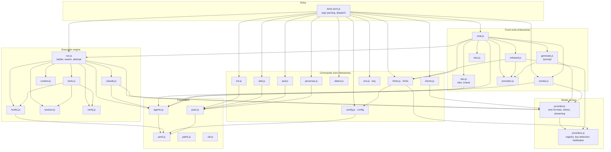
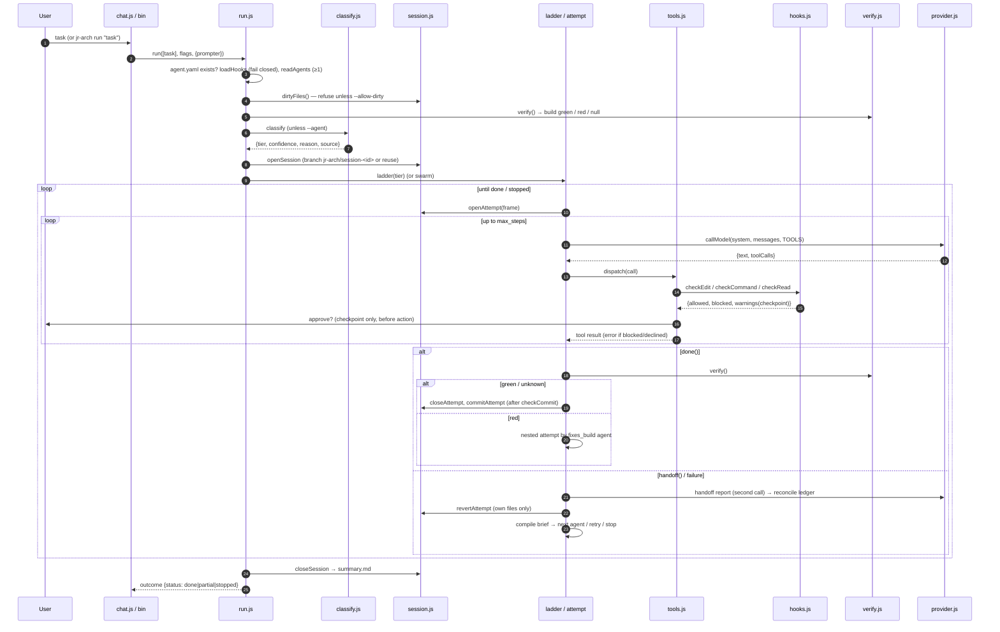
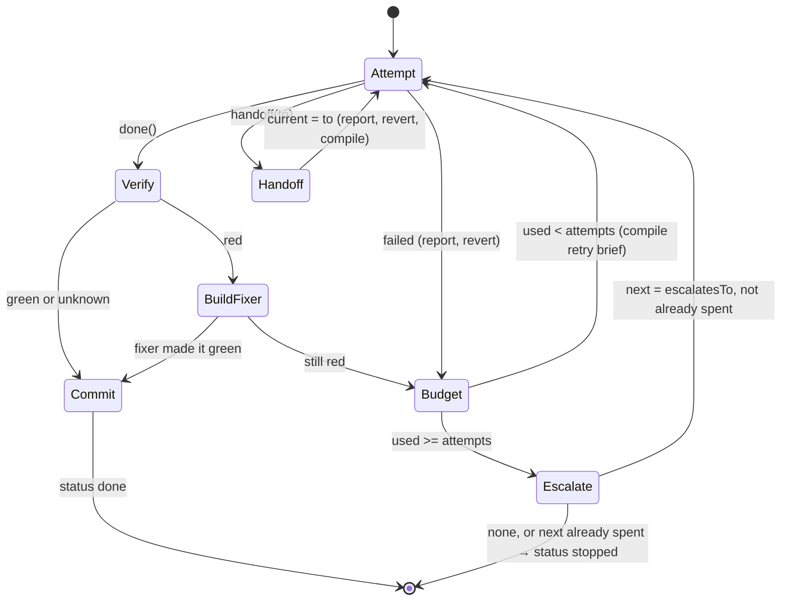
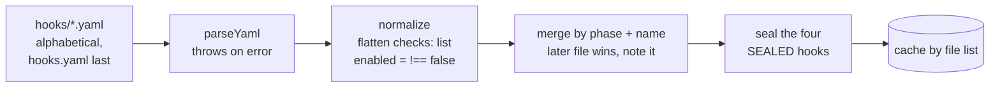
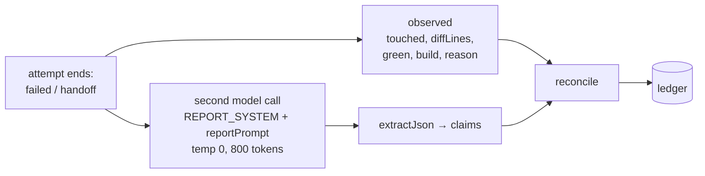
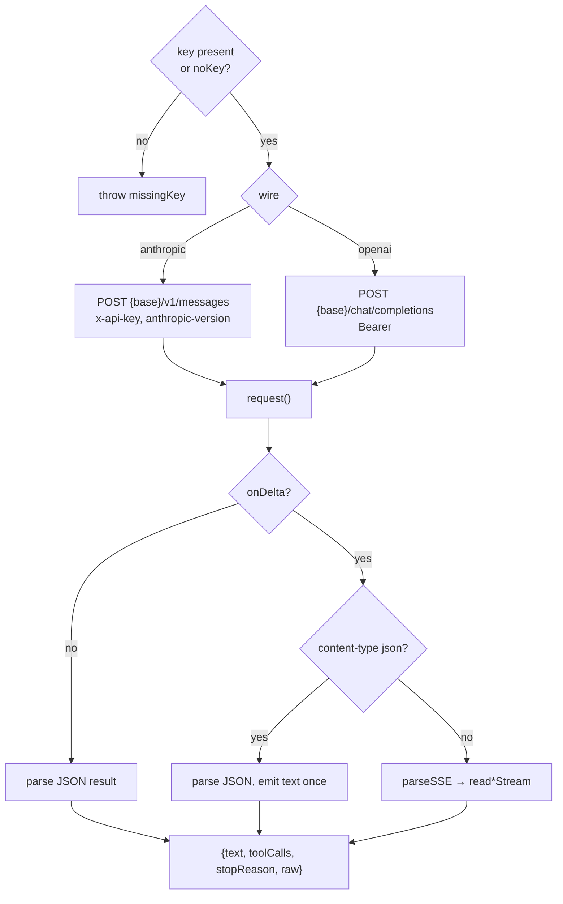
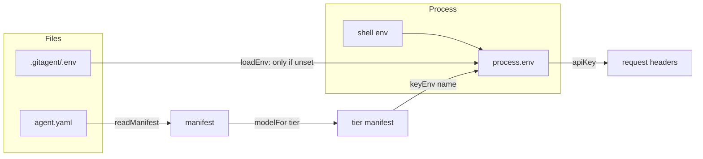
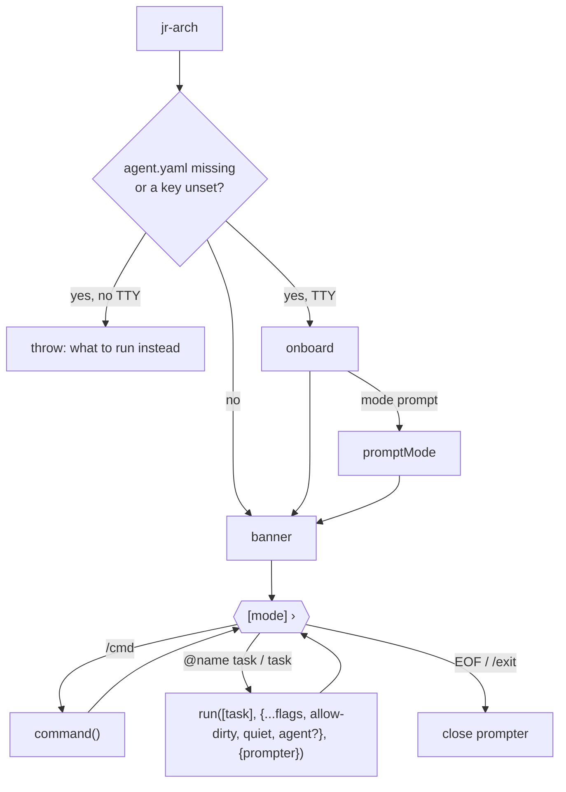
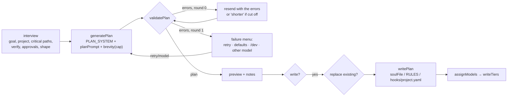
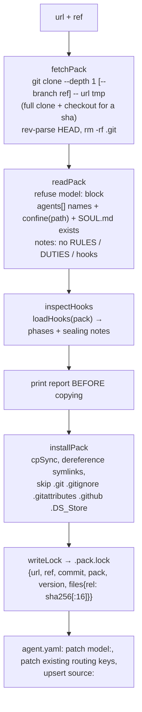

# jr-arch architecture

This document describes how jr-arch is put together: the pieces, how data moves
between them, and where each responsibility lives. It describes the code as of
version 0.1.3.

For *using* the tool, see [README.md](README.md). For working *on* it (the
procedures, the decisions log and known gaps), see [RUNBOOK.md](RUNBOOK.md).

---

## Contents

1. [What the system is](#1-what-the-system-is)
2. [Design principles](#2-design-principles)
3. [Layers and module map](#3-layers-and-module-map)
4. [The `.gitagent/` data model](#4-the-gitagent-data-model)
5. [Lifecycle of a task](#5-lifecycle-of-a-task)
6. [Routing: the classifier](#6-routing-the-classifier) · [System One path](#61-the-system-one-path-classify-fastjs)
7. [The ladder](#7-the-ladder)
8. [One attempt: the agent loop](#8-one-attempt-the-agent-loop)
9. [The tool surface](#9-the-tool-surface)
10. [The guardrail engine](#10-the-guardrail-engine)
11. [Sessions, git and rollback](#11-sessions-git-and-rollback)
12. [The context ledger and handoff compiler](#12-the-context-ledger-and-handoff-compiler)
13. [Swarm](#13-swarm)
14. [Verification](#14-verification)
15. [The provider layer](#15-the-provider-layer)
16. [Configuration and secrets](#16-configuration-and-secrets)
17. [Interactive front ends](#17-interactive-front-ends)
18. [Packs: install, add, pull](#18-packs-install-add-pull)
19. [The YAML parser](#19-the-yaml-parser)
20. [Trust boundaries](#20-trust-boundaries)
21. [Testing architecture](#21-testing-architecture)

---

## 1. What the system is

jr-arch is a Node CLI with **zero runtime dependencies**. It does two jobs:

1. **Scaffolds** a GAP-format `.gitagent/` folder into a repository. The folder
   holds agents (Markdown personas), guardrails (YAML hooks), a manifest
   (`agent.yaml`), and a handoff protocol (`DUTIES.md`).
2. **Runs** those agents against the repository. It classifies a task to an
   agent, drives a tool-calling loop against the user's own model provider, and
   gates every write and command through a guardrail engine the model cannot
   bypass. It verifies with the project's own build, commits on a session
   branch, and escalates or rolls back on failure.

The user supplies the model and the key. The CLI makes no network calls of its
own; the only outbound traffic goes to the configured provider, to explicit
`git clone`s of packs, and — only if the user adds a `routing.classifier`
block — to the System One model that picks the entry agent (§6.1).

```
               ┌───────────────────── user's machine ──────────────────────┐
               │                                                           │
  terminal ───▶│  bin/jr-arch.js ──▶ chat / run / init / add / pull / …    │
               │          │                                                │
               │          ▼                                                │
               │   .gitagent/  (agents, hooks, agent.yaml, DUTIES, .env)   │
               │          │                                                │
               │          ▼                                                │
               │   run loop ──▶ tools ──▶ hooks ──▶ fs / execFile / git    │
               │          │                                                │
               └──────────┼────────────────────────────────────────────────┘
                          ▼
            user's provider (Anthropic / OpenAI-wire endpoints)
```

---

## 2. Design principles

These shape almost every module. The full rationale for each is in the RUNBOOK
decisions log.

| Principle | Consequence in code |
|---|---|
| **Enforced, not suggested** | Guardrails live in `hooks.js` and run on every tool call. `RULES.md` is prompt text; `hooks/` is the actual control. |
| **The model proposes, the harness writes** | Tool calls are *requests*. `/prompt` plans are validated data, and the files are built from validated values. |
| **Agents describe themselves** | Priority, scope, escalation, attempts and terminality are front matter in each `SOUL.md`. No agent name appears in executable routing code. |
| **The directory is the registry** | `readAgents()` reads `agents/`, and `loadHooks()` reads `hooks/*.yaml`. Neither has a manifest list. |
| **Fail closed** | An unparseable guard file aborts the run. A checkpoint with nobody to ask is declined. An unknown build state is not a pass. |
| **Blocks are information** | A blocked tool call returns a tool *error* with instructions, and the loop continues. |
| **Record, not transcript** | Handoffs carry a bounded, provenance-stamped ledger, never provider-shaped message history. |
| **An agent owns only its own work** | Rollback is per-file and scoped to what the attempt touched. |
| **One path for everything** | Chat is a front door onto `run()`, and every question goes through one prompter. |
| **Zero deps, no telemetry** | Hand-rolled argv parsing, YAML subset parser, `fetch` for HTTP, `execFileSync` for processes. |

---

## 3. Layers and module map



### Module responsibilities

| Module | Lines | Responsibility | Key exports |
|---|---:|---|---|
| `bin/jr-arch.js` | 152 | Reads version from `package.json`, parses argv (`BOOLEAN` set decides arity), calls `loadEnv()`, dispatches, and turns thrown errors into `✗ message` with exit code 1 | none |
| `src/run.js` | 838 | The execution loop: preconditions, classification, session, **ladder**, **swarm**, **attempt**, verify + build-fixer nesting, commit, checkpoints, prompt assembly, handoff reports, resume | `run`, `ladder`, `swarm`, `swarmFor`, `escalate` |
| `src/tools.js` | 320 | The six tools the model sees and their handlers. Every call is gated by hooks, then approval, then action | `TOOLS`, `dispatch`, `inside` |
| `src/hooks.js` | 705 | Guardrail engine: loading and sealing, globbing, secret scanning, `checkEdit` / `checkCommand` / `checkRead` / `checkCommit` | `loadHooks`, `hookFiles`, `checkEdit`, `checkCommand`, `checkRead`, `checkCommit`, `globToRegExp`, `normalizePath`, `lineDelta` |
| `src/session.js` | 424 | Harness-owned git, session directory, transcript (redacted), attempt frames, scoped diff/revert/commit, resume reading | `git`, `openSession`, `openAttempt`, `closeAttempt`, `revertAttempt`, `commitAttempt`, `attemptPaths`, `readSession`, `resumeBrief`, `record` |
| `src/context.js` | 264 | Ledger (`newLedger`, `reconcile`), handoff compiler (`compile`), report prompt | `newLedger`, `reconcile`, `compile`, `REPORT_SYSTEM`, `reportPrompt` |
| `src/classify.js` | ~200 | Picks the entry agent: pinned → red build → System One (if configured) → one model call → floor bump / fallback | `classify` |
| `src/classify-fast.js` | ~250 | Optional System One classifier (TypeSafe Jev): typed choice/noul questions, calibrated probability, no prose. Opt-in, and returns null on any failure so the model classifier runs | `CLASSIFIERS`, `classifierConfig`, `ask`, `answerFor`, `stateFor`, `fastClassify`, `fastSwarm` |
| `src/agents.js` | 240 | Reads agents from front matter; escalation, cycles, build fixer, scope ownership, partition, swarm grouping, disjointness | `readAgents`, `frontMatter`, `findAgent`, `escalatesTo`, `escalationCycle`, `buildFixer`, `ownsPath`, `partition`, `swarmable`, `disjoint` |
| `src/verify.js` | 139 | Detects and runs the project's build/test; Windows `.cmd` shim handling; head+tail output truncation | `detect`, `verify`, `resolveBin`, `winCmd`, `tail` |
| `src/provider.js` | 601 | Provider-neutral transcript ↔ Anthropic/OpenAI wire; `request()` with limit recovery; SSE parsing; key redaction; JSON extraction | `callModel`, `ProviderError`, `parseProviderError`, `parseSSE`, `readAnthropicStream`, `readOpenAIStream`, `extractJson`, `redact`, `apiKey`, `requiresKey`, `missingKey` |
| `src/budget.js` | ~230 | Token estimation, the per-request budget, request fitting (reply cap, then oldest tool output), and calibration from provider rejections | `estimateTokens`, `estimateRequest`, `budgetFor`, `readCeiling`, `fit`, `calibrate`, `describeBudget`, `formatTokens` |
| `src/limits.js` | ~330 | Rate-limit headers from any provider, normalised; the 1-token probe; the reply-cap table; the `limits` command | `parseRateLimits`, `probeLimits`, `printProviderLimits`, `printAgentCaps`, `agentCaps`, `suggestedCap`, `showLimits`, `limits` |
| `src/providers.js` | 191 | Provider registry, key-prefix detection, endpoint resolution, live model listing, chat-model filter | `PROVIDERS`, `detectProvider`, `baseUrlFor`, `wireFor`, `listModels`, `isChatModel`, `KeyRejected` |
| `src/config.js` | 227 | The one `agent.yaml` reader; line-based section patchers; per-tier model resolution; `config` command | `readManifest`, `modelFor`, `keyEnvs`, `patchSection`, `patchSequence`, `upsertSection`, `upsertScalar`, `patchTierModel`, `setModelMaxTokens`, `setTierMaxTokens`, `clearTierMaxTokens`, `config` |
| `src/env.js` | 192 | `.gitagent/.env` parsing/loading (shell wins), `.gitignore` guard, key writing, `key` command | `loadEnv`, `parseEnv`, `ensureIgnored`, `writeKey`, `removeKey`, `keySource`, `fingerprint`, `key` |
| `src/init.js` | 203 | Scaffold from templates / `--minimal` / `--from` pack; patch `model:`; gitignore rules | `init` |
| `src/pack.js` | 406 | Clone, validate (`gitagent.yaml`), confine paths, inspect hooks, install, lock file, update planning | `fetchPack`, `readPack`, `confine`, `inspectHooks`, `installPack`, `packFiles`, `writeLock`, `readLock`, `planUpdate` |
| `src/pull.js` | 153 | Three-way merge update of an installed pack against `.pack.lock` | `pull` |
| `src/add.js` | 230 | `add-agent`, `add-guard` from any git repo | `addAgent`, `addGuard` |
| `src/personas.js` | 127 | `personas list / add / remove`, single-persona pull | `personas` |
| `src/chat.js` | 338 | Default command: setup gate, REPL, slash commands, `@agent`, each turn → `run()` | `chat` |
| `src/onboard.js` | 215 | First-run flow: key → models → scaffold → mode; reusable steps | `onboard`, `obtainKey`, `pickModel`, `setModel` |
| `src/generate.js` | 658 | `/prompt`: interview → plan → validate → preview → write → assign models | `promptMode`, `interview`, `generatePlan`, `validatePlan`, `soulFile`, `guardFile`, `writePlan`, `writeTiers`, `brevity` |
| `src/dev.js` | 214 | `/dev` scaffolds and `/check` static validation | `newAgent`, `newGuard`, `checkAll`, `printCheck`, `pathsFor`, `DEV_HELP` |
| `src/smoke.js` | 143 | Six-stage per-agent readiness check | `smokeTest`, `printSmoke`, `smoke` |
| `src/doctor.js` | 74 | JSON + tool-call capability probe for the default model | `doctor` |
| `src/detect.js` | 152 | File-presence stack report (stacks, lockfiles, frameworks, monorepo, CI) | `inspect`, `detect` |
| `src/prompter.js` | 215 | The single readline interface: ask/choose/confirm/secret; masked echo; Windows Ctrl+V; scripted test double | `createPrompter`, `scriptedPrompter` |
| `src/tree.js` | 99 | Annotated `.gitagent/` tree | `renderTree`, `printTree`, `filesUnder` |
| `src/yaml.js` | 270 | Strict YAML subset parser | `parseYaml` |
| `src/paths.js` | 21 | `repoRoot()` (walks up to `.git`, else cwd), `agentDir()`, `TEMPLATES` | |
| `src/util.js` | 7 | Colour (`NO_COLOR`, TTY-aware) and `ok/info/warn` | |

---

## 4. The `.gitagent/` data model

```
.gitagent/
├── agent.yaml          manifest: model, tiers, routing, (git), (source)
├── DUTIES.md           protocol prose, given to every agent and the classifier
├── agents/<name>/
│   ├── SOUL.md         front matter (routing metadata) + identity prose
│   ├── RULES.md        constraint prose
│   └── .source         add-agent provenance: url \n sha
├── hooks/*.yaml        guard files; hooks.yaml loads last
├── config/default.yaml the telemetry claim, in the user's own repo
├── memory/MEMORY.md    notes the user keeps; nothing reads or writes it
├── .pack.lock          JSON: url, ref, commit, pack, version, files{path: sha256/16}
├── .env                KEY=value, gitignored, 0600
└── .session/<id>/      gitignored run artefacts
    ├── task.md
    ├── transcript.jsonl
    ├── attempt-<n>.diff
    └── summary.md
```

### Agent record (in memory)

`readAgents()` turns each `agents/<dir>/SOUL.md` into:

```js
{
  name,          // the directory name, not front matter
  dir,
  role,          // string
  priority,      // number, default 50; sort key (then name)
  parallel,      // === true
  owns,          // string[] of globs; [] = owns anything
  escalatesTo,   // string | null
  terminal,      // === true
  fixesBuild,    // === true
  attempts,      // number | null (null → routing.default_attempts)
  hasRules,      // RULES.md exists
}
```

If the front matter is malformed, the agent loses its metadata but still exists
with the defaults. `/check` and `/smoke` exist largely to surface that case.

### Manifest (in memory)

`readManifest()` is the only reader of `agent.yaml`. It returns a flat shape
that every model consumer speaks:

```js
{ provider, model, keyEnv, baseUrl, entry, temperature, maxTokens,
  defaultAttempts, diffCeiling, confidenceFloor, degradedFallback,
  agents /* legacy */, source, identity, memory, tiers, raw }
```

`modelFor(manifest, agentName)` returns **the same shape** with that agent's
`tiers.<name>.model` overrides applied. When the provider changes and the tier
doesn't name its own `base_url`, the inherited `base_url` is dropped.

### Hook set (in memory)

```js
{ file, files, notes,
  pre_edit:    { [name]: hook },
  pre_command: { [name]: hook },
  pre_commit:  { [name]: hook },
  post_run:    { [name]: hook } }
```

---

## 5. Lifecycle of a task



### Preconditions in `run()` (order matters)

1. `.gitagent/agent.yaml` exists.
2. `--resume` resolves the prior session first; after that, a task is required.
3. `readManifest()`, then `loadHooks(dir, {reload:true})`. A guard file that
   fails to parse throws here, and the notes print as warnings.
4. `readAgents()` returns at least one agent. Zero agents is an error; the code
   never falls back to built-in defaults.
5. `requireGit()`, skipped by `--no-git`. Rollback and the session branch need
   a repository with at least one commit, so a plain folder throws with
   `code: 'NO_GIT_REPO'` and an empty repository with `code: 'NO_COMMITS'`.
   The chat catches both codes and offers `ensureRepo()` (`git init` plus a
   first commit that leaves out `.gitagent/.env` and `node_modules/`) instead
   of printing advice about a launch flag nobody can type mid-chat.
6. Dirty tree check, skipped by `--allow-dirty`.
7. `verify()`, skipped by `--skip-verify`.
8. `--agent` must name an installed agent.
9. `--dry-run` returns after classification, before any session exists.
10. Pre-flight budget: `fit()` on the first request. When the system prompt and
    tools alone exceed the key's per-request budget, the run stops with
    `fatal: 'budget'` before spending a request.

### The `ctx` object

`run()` builds one context and passes it, spread and extended, down through
the ladder, attempts and tools:

| Field | Purpose |
|---|---|
| `root`, `dir` | repo root, `.gitagent/` |
| `session` | from `openSession` |
| `hooks` | loaded hook set |
| `manifest`, `tierModel` | base manifest; per-attempt `modelFor` result |
| `agents`, `tiers` | agent records; their names (handoff target validation) |
| `maxSteps`, `contextBudget` | from `routing` |
| `call` | `callModel` (injectable, scripted in tests) |
| `interactive`, `stream`, `autoApprove`, `prompter` | checkpoint and output behaviour |
| `askLock` | shared promise chain, so parallel checkpoints queue |
| `gitQueue` | shared promise chain for swarm git bookkeeping |
| `ledger` | canonical execution state |
| `tier`, `touched`, `approve` | added per attempt for `tools.js` |

---

## 6. Routing: the classifier

`classify.js` decides the entry agent. It checks these cases in order and stops
at the first match:

```
┌──────────────────────────────┐
│ routing.entry != auto ?      │──yes──▶ that agent (must be installed, else throw)
└──────────────┬───────────────┘         source: config, no network
               no
┌──────────────▼───────────────┐
│ build red AND a fixes_build  │──yes──▶ the fixer
│ agent installed?             │         source: repo-state, no network
└──────────────┬───────────────┘
               no
┌──────────────▼───────────────┐
│ routing.classifier set?      │──yes─▶ one System One call (choice over the
│ (opt-in, see below)          │         installed agents) → calibrated p
└──────────────┬───────────────┘         source: system-one
               no, or it declined
┌──────────────▼───────────────┐
│ one model call               │  system: SYSTEM + tier names + DUTIES.md
│ temp 0, 256 tokens           │  user:   task + build state + ≤300 repo files
└──────────────┬───────────────┘
               │ extractJson
      ┌────────┴──────────┐
 unusable / unknown tier   valid tier
      │                    │
      ▼                    ▼
 degraded_fallback    confidence < floor ?
 (or last by          ──yes──▶ escalatesTo(classified) (or stay)  source: floor-bump
  priority)           ──no───▶ classified tier                     source: model
 source: fallback
```

- `--agent` / `@name` skip `classify()` entirely (`source: explicit`).
- `DUTIES.md` is optional here as everywhere else: when it is absent the
  classifier states the default entry rules itself. The prompt always carries
  each agent's own declaration (role, priority, scope, who it escalates to), so
  routing does not depend on a file the user may have deleted.
- The low-confidence bump only moves the task *up*: sending it to too senior an
  agent costs tokens, while sending it too low causes thrash. Both classifier
  paths go through one `withFloor()`, so the rule cannot drift between them.

### 6.1 The System One path (`classify-fast.js`)

A *System One* model takes structured state plus typed questions and returns
typed answers carrying a calibrated probability. It generates no text. Tier
selection is exactly that shape, so when `routing.classifier` is set it is
asked first.

```
state     { task, build, file_count, files[≤300],
            agents[{name, role, priority, owns, repairs_build,
                    terminal, escalates_to}],
            entry_rules }                       ← DUTIES.md, ≤4000 chars
questions { tier: { type: "choice", options: readAgents().map(name) } }
           │
           ▼  POST {base}/systemone, Bearer {api_key_env}, 4s timeout
answer    { choice, confidence, probabilities }  → answerFor()
```

Design constraints, each of which has a test:

| Constraint | Why |
|---|---|
| **Not in `providers.js`** | That registry is chat models. Onboarding, `listModels` and `modelFor` all read it, and would offer a model with no tool calling that `doctor` would rightly fail |
| **Opt-in, absent by default** | It is a second destination for the task text and file list. `config show` names it, set or unset |
| **Always allowed to decline** | Missing key, 401, timeout, or an envelope `answerFor` does not recognise → `null` → the model classifier runs. A beta API must not decide whether routing works at all |
| **Options come from `readAgents()`** | No default agent name reaches the code, and an option outside the set we supplied is refused |
| **Never enforces** | Guards, checkpoints, `disjoint()` and build state stay deterministic. `test/classify-fast.test.js` asserts `hooks.js`, `tools.js`, `verify.js` and `session.js` do not import it |

`answerFor()` is deliberately tolerant about the response envelope (`answers` /
`questions` / `results` / bare) and the value key (`choice` / `value` /
`answer` / `noul` / `score`), because the raw JSON shape is not pinned by the
published docs. Anything it cannot read becomes `null`, never a guess — pulling
a tier name out of an assumed shape is worse than falling back.

Because no prose is produced, `reason` is rendered from the distribution:
`junior-dev 0.71 · ui-editor 0.22`. A missing `confidence` is read as `1`, not
`0`: `Number(null)` is a finite zero, and reading silence as zero confidence
would bump *every* task up a tier.

**Adding the key.** A chat provider proves its key with `listModels`; a System
One model publishes no list, so `verifyKey()` asks the smallest real question
instead — one two-option choice — and a 200 is the proof. `jr-arch key jev
<key>` (aliases resolve through `classifierByName`) verifies first, then writes
the key and `setClassifier()` writes the `routing.classifier` block. Both, in
that order: a key saved without the block is a key nothing reads, and a block
written against a key that does not work makes every run print the fallback
notice, which reads as a broken tool rather than a rejected key. `setClassifier`
is a line-based nested patcher for the usual reason — round-tripping
`agent.yaml` through the parser would serialize away its comments — and it
leaves the template's commented example in place, writing the live block after
it.

`fastSwarm()` answers the swarm question the same way — one `noul` per agent in
a single request, keyed positionally (`a0`, `a1`) so a name cannot come back
misspelled.

---

## 7. The ladder

`ladder(ctx, {tier, task, brief})` walks agents until one finishes or a terminal
agent gives up.



Rules encoded in the loop:

- **The attempt budget is per agent, not per run.** `used[name]` counts each
  agent's attempts separately. The budget comes from the agent's `attempts`,
  then `routing.default_attempts`, then 2.
- **A handoff switches agent immediately** and doesn't count against the
  budget check at the bottom of the loop (`continue`).
- **Handoff and failure both revert.** Half-finished edits aren't a useful
  starting point for the next agent. The *record* moves forward, the edits
  don't.
- **Red after `done()`** means the attempt is closed as failed, then
  `callBuildDoctor` runs the `fixes_build` agent as a **nested attempt** (its
  frame has `parent`). The fixer gets its own brief, its own scope, and its own
  model. If it gets the build green, the *original* agent's summary is
  committed: the fixer hands control back and never takes over the task.
- **Escalation refuses a spent target.** If `escalatesTo` names an agent that
  already used its attempts, the ladder stops. This prevents an A↔B loop from
  running forever.
- **What "stopped" means:** the outcome has `status: 'stopped'`, and `finish()`
  prints "Stopped and escalated to you" with the transcript path.

---

## 8. One attempt: the agent loop

`attempt(ctx, frame, brief)` in `run.js`.

```
messages = [{role:user, content: brief}]
system   = prompt(ctx, agent)
while frame.steps < max_steps:
    budget = min(ctx.budget, liveRemaining(model))       what is left of this minute
    room   = fit(system, messages, tools, budget, regrow?)
    if !room.fits:
        wait = msUntilRefill(model) → sleep once, exactly that long, and refit
        still no fit → fatal("does not fit the key's budget")
    reply = call(tierModel, {system, messages: room.messages, tools: TOOLS, maxTokens: room.maxTokens})
    if model call throws:
        isFatalProviderError (model, auth, daily limit) → fatal(kind)
        too-large naming a lower limit → learn it (setTokensPerMinute), refit, retry
        otherwise → failed("model call failed: …")
    if the reply was cut off at room.maxTokens with no usable tool call:
        resend once with regrow = 2 × the cap
    if no tool calls:
        step 1 → failed("replied with prose … run doctor")
        3 in a row → failed("stopped acting")
        push "Continue, or call done()"; continue
    for each tool call:
        if a control call already happened this turn → "Skipped" error
        read_file / list_files / run_command with the same arguments:
            third time, or more than 4 repeats, with no write between → fatal("stuck")
        out = dispatch(call, toolCtx)                     a write resets the repeat count
        if out.control → remember it
    push tool results
    done → {kind: done, summary}
    handoff → {kind: handoff, to, reason}
failed("hit the N-step ceiling")
```

A `fatal` result ends the whole ladder, not just the attempt. Another attempt
or another agent on the same key would only spend a request to hear the same
refusal: a model that does not exist, a rejected key, a spent daily allowance,
a prompt that cannot fit, or an agent going round in circles. The chat offers
to pick a different model when a turn ends this way.

The stuck guard exists because of one real run: an 11k-token file on a
7k-per-request key, each slice dropped to make room for the next, and the agent
re-reading it until 199,378 of the day's 200,000 tokens were gone.

### System prompt assembly (`prompt()`)

Sections are joined with `---`:

1. The agent's `SOUL.md` **body** (front matter stripped).
2. The agent's `RULES.md`.
3. `# Duties and escalation` + `DUTIES.md`, if present.
4. `# How you operate`, generated: the agent's name, the other installed agents
   and their roles, its scope, how the tools behave (whole-file writes, argv
   with no shell), that guardrails are harness-enforced, when to call `done()`,
   and when to call `handoff()` (only if other agents exist).

There is **no global SOUL/RULES**. The harness adds operating mechanics only,
never identity.

### Provider-neutral transcript

```js
{ role: 'user',      content: string }
{ role: 'assistant', text: string, toolCalls: [{ id, name, input }] }
{ role: 'tool',      results: [{ id, name, content, isError }] }
```

`provider.js` converts this to the wire format at call time. The history lives
only in memory for the length of one attempt and is never written to disk.

### Checkpoint approval

`toolCtx.approve(cp)`:
1. If the same `hook + reason` was declined earlier in this attempt, return
   `false` without asking again.
2. Otherwise `checkpoint()` queues on `ctx.askLock`, then `ask()`:
   - `--yes` → approve.
   - a prompter was passed (chat) → `prompter.confirm('Allow?', false)`.
   - not interactive → decline.
   - otherwise a temporary prompter is created, asks, and closes.

---

## 9. The tool surface

`tools.js` defines exactly six tools. The model can reach nothing else.

| Tool | Gate | Action | Notes |
|---|---|---|---|
| `read_file(path, start_line?, line_count?)` | `inside()` → `checkRead` | `readFileSync` | Directory and binary files are rejected. Returns whole lines up to `readCeiling()` (sized to the key's budget, at most 200,000 characters) under a `[path · lines a-b of N]` header, and names the `start_line` to continue from. Numbers are plain digits, never locale-formatted |
| `list_files(path?)` | `inside()` | recursive walk | Skips `.git`, `node_modules`, `dist`, `build`, `.next`, `target`, `__pycache__`, `.venv`; 400 entries shown |
| `write_file(path, content)` | `inside()` → `checkEdit(before, after)` → approve | `mkdir -p` + `writeFileSync`; adds to `touched` | Whole-file content, never patches |
| `run_command(command[])` | argv shape → `checkCommand` → approve → `resolveBin` | `execFileSync`, no shell, 120s timeout, cwd = root | Non-zero exit is returned as an error result with output (head+tail) |
| `handoff(to, reason)` | `to` must be installed and not self | none | returns `control: {kind:'handoff'}` |
| `done(summary)` | none | none | returns `control: {kind:'done'}` |

```
tool call ──▶ unknown name?  ──▶ error
         ──▶ __parseError?   ──▶ error ("arguments were not valid JSON")
         ──▶ handler
               ├─ inside(root, path)    path confinement (no ../, no escape)
               ├─ hooks check           blocked → error listing hook + reason
               ├─ approved(gate, ctx)   checkpoint warnings → ask BEFORE acting
               │                        declined → error "Nothing was changed"
               └─ act
         ──▶ record(session, 'tool', {tool, tier, path, command, isError})
         ──▶ unexpected throw → error "<tool> failed: …"  (never ends the run)
```

`inside()` and the hooks do different jobs. `inside()` confines a path to the
repository. The hooks decide which paths *within* the repository an agent may
touch.

---

## 10. The guardrail engine

`hooks.js`. All checks return `{allowed, blocked: [{hook, reason}], warnings: [{hook, reason, checkpoint}]}`.

### Loading and sealing



`seal(name, declared)`:
- The starting point is `SEALED_FLOOR[name]` (these defaults apply even when no
  file exists).
- `name`, `severity`, `overridable:false` and `enabled:true` are always taken
  from code. Any attempt in a file to change them produces a note.
- `known_prefixes`, `paths` and `commands` become the **union** of the floor
  and the declared values, so a file can only widen them.
- For `secret-scan`, `high_entropy.ignore_paths` is honoured, but a universal
  glob (`*`, `**`, `**/*`, `**/**`) is refused. Ignored paths skip only the
  entropy heuristic; prefix matches always fire.

| Sealed hook | Phase | Floor |
|---|---|---|
| `secret-scan` | pre_edit | prefixes `sk-` `ghp_` `gho_` `AKIA` `AIza` `xoxb-` `-----BEGIN`; entropy ≥ 4.0 bits/char over ≥ 32 chars |
| `no-force-push` | pre_command | history rewrite detection (logic, not list) |
| `protected-read` | pre_command | `.env*` `.git/**` `**/*.pem` `**/id_rsa*` `**/.npmrc` `**/.aws/credentials` |
| `no-sudo` | pre_command | `sudo` `doas` `su` `runas` |

### Built-in logic vs enforcement by shape

Each check function runs dedicated logic for the built-in hook names first, then
enforces **every other active hook by the fields it declares**:

| Check | Built-in names with dedicated logic | Shape enforcement for other hooks |
|---|---|---|
| `checkEdit(path, {before, after}, tier)` | `secret-scan` (added lines only via `lineDelta`), `protected-paths`, `scope-fence` (`applies_to` + `allow`/`deny`), `diff-ceiling` (added+removed > `max_lines` → checkpoint) | `paths` match, filtered by `applies_to` |
| `checkCommand(argv, tier)` | `no-sudo`, `no-force-push` (push `--force`/`-f`/`+ref`/`--delete`/`:ref`, `reset --hard`, `rebase`, `commit --amend`, `filter-branch`, `update-ref -d`, `reflog expire`, `branch -D`), `protected-read` (path-like tokens incl. `--x=value`), `no-exfil` (listed binary + network-looking arg), `destructive` (`rm -rf`, `rmdir /s`, `git clean -f`, `checkout -- .`, `restore .`, `dropdb`, SQL DROP/TRUNCATE), `dep-change` (per-ecosystem subcommands → checkpoint; bare `npm install` allowed) | `commands` by basename, else `paths` on path tokens, filtered by `applies_to` |
| `checkRead(path, tier)` | `protected-read` | any `pre_command` hook with `paths` and severity `block` also blocks reading |
| `checkCommit(files, green)` | `build-gate` (red → block; unknown → warn), whole-file `secret-scan`, `protected-paths` | none |

`enforce(hook)` maps a hook's severity to an outcome: `checkpoint` severity or
`checkpoint: true` → a checkpoint warning; `warn` → a plain warning; anything
else → a block.

Binaries are compared by basename with `.exe`, `.cmd`, `.bat` and `.ps1`
stripped, so `/usr/bin/sudo` and `sudo.exe` both match `sudo`.

### Glob semantics (`globToRegExp`)

- A pattern with no `/` is unanchored and matches the basename at any depth.
- A pattern with a `/` is anchored at the repo root.
- `**/` matches zero or more path segments; `**` elsewhere matches anything; `*`
  matches within one segment; `?` matches one character.
- `{a,b}` alternation and `[...]` classes are supported.
- Matching is case-insensitive.

### Secret scanning detail

- `lineDelta(before, after)` is a *multiset* difference: it returns lines in
  `after` that aren't accounted for in `before`. A moved line counts as
  unchanged. This is deliberate: a file that already contains a fixture-shaped
  string must stay editable.
- Reported tokens are masked to four characters plus a length, because a block
  reason ends up in the model transcript and on screen.
- Prefixes are matched **per token, anchored at its start**, and a prefixed
  token must also look like a credential: at least 20 characters, a body of at
  least 12 with both letters and digits, and entropy of at least 3.0 bits per
  character. A structural prefix (`-----BEGIN`) skips those rules. This is what
  separates `sk-proj-…48 random chars…` from `sk-button-primary-large`, and it
  matters because the hook is sealed — a false positive here is one the user
  cannot switch off.
- Lines carrying an inline `data:` URI skip the entropy heuristic: embedded
  images are high-entropy by nature and carry nothing secret.

---

## 11. Sessions, git and rollback

`session.js` is the **harness's** git, and its calls don't go through
`checkCommand`.

### Session

`openSession({root, task, branch, prefix, reuseBranch})`:
- The id is `YYYYMMDD-HHMMSS-<4 random>`, so ids sort chronologically.
- It creates `.gitagent/.session/<id>/` and writes `task.md`.
- Branch selection, when branching is enabled and HEAD has a commit:
  - `reuseBranch` names a different existing branch → check it out (resume).
  - `reuseBranch` is the current branch → stay on it (chat on its session
    branch).
  - otherwise `git checkout -b <prefix>/session-<id>`.
- The chat passes `reuseBranch = current branch if it starts with <prefix>/session-`.

### Transcript

`record(session, event, data)` appends JSON lines. Every string value passes
through `redact(value, process.env[session.keyEnv])` **before** it is written.
Logging failures are swallowed so that a logging problem never kills a run.

Events: `session.open`, `attempt.open`, `tool`, `attempt.close`,
`attempt.revert`, `attempt.commit`, `ledger`, `session.close`.

### Attempt frame

```js
{ n, tier, task, parent, reason, owns, sha /* HEAD at open */, steps,
  status, diff, verify, touched /* Set, shared with toolCtx */ }
```

### The set of paths an attempt answers for

```
attemptPaths(frame) = frame.touched
                    ∪ (if owns non-empty) { dirty files matching owns }
```

The union means that a `run_command` that edits files in scope (a formatter,
codegen) is still attributed to the attempt. An agent with no scope gets only
the files it explicitly wrote, so it can't claim another agent's changes.

### Diff, revert, commit

| Operation | Implementation |
|---|---|
| `closeAttempt` diff | `git add --intent-to-add -- <paths>` then `git diff <frame.sha> -- <paths>`, written to `attempt-<n>.diff` |
| `revertAttempt` | for each path: existed at `frame.sha` → `git checkout <sha> -- path`; else `rmSync` |
| `commitAttempt` | `git add -- <attemptPaths>`, then `git commit -- <attemptPaths>`: a pathspec commit takes those paths from the working tree and cannot pick up a sibling's change or the user's own uncommitted work. Message: `<tier>: <summary ≤68>\n\nvia jr-arch` |

`commit()` in `run.js` first runs `checkCommit(attemptPaths(frame), frame.verify.green)`
— the same set that will be staged, so nothing reaches history unscanned.
If any commit hook blocks, the commit is skipped with a warning and the work
stays in the tree. `git.auto_commit: false` (read from `agent.yaml`) skips
committing entirely.

### Resume

`readSession(id)` rebuilds `{task, branch, startBranch, status, attempts[]}`
from `task.md`, the transcript events and the `.diff` files. `run --resume`:
- refuses a session whose status is `done`;
- builds the first brief with `resumeBrief(prior)`: the task, why it's back,
  the attempt history, and the failed diffs;
- seeds the ledger with each non-done prior attempt as a verified `failed`
  entry;
- reuses the prior branch.

Message history is **not** stored, so resuming isn't a conversation replay.

---

## 12. The context ledger and handoff compiler

`context.js`, ported and narrowed from the Context Orchestration Engine.

### Ledger shape

```js
{ task, objective,
  decisions:   [{what, why, recorded_by, recorded_at, verified}],
  completed:   [{what, files[], …stamp}],
  artifacts:   [{path, …stamp}],          // harness-observed writes
  issues:      [{what, open, closed_by?, …stamp}],
  failed:      [{tier, approach, why, diffLines, …stamp}],   // append-only
  assumptions: [{what, …stamp}],
  notes:       [{what, …stamp}],
  next:        {what, …stamp} | null }
```

### Producing a record after a failure or handoff



The report call failing isn't fatal: the claims are just empty, and the
observed half is still recorded.

### The four invariants (enforced in `reconcile`)

1. **An unverified claim never closes an issue.** `resolved` only closes an
   issue when `observed.green === true`.
2. **A file named only in prose is unverified.** A `completed` entry is marked
   verified only when one of its files is in `observed.touched`.
3. **Failed attempts are append-only.** The engine writes a failed entry for
   every failed/handoff status. No code path removes entries.
4. **Provenance is stamped by the engine.** `recorded_by`, `recorded_at` and
   `verified` come from `stamp()`, never from the model's claims.

Artifacts are added for every observed write whether or not the model mentions
them.

### Compiling a brief

`compile(ledger, {to, reason, budget})`:

- The sections, in fill order: `task`, `objective`, `next`, `decisions`,
  `completed`, `artifacts`, `issues` (open only), `failed`, `assumptions`,
  `notes`.
- `task` and `objective` are **pinned**: always included, never trimmed.
- Each later section goes in whole if it fits the remaining budget. Otherwise
  whole lines are trimmed (if at least 80 characters remain), or the section is
  dropped.
- The `## Why this reached you` header is placed right after the task.
- Anything trimmed or dropped is listed in a footer. The successor is always
  told the record is incomplete.
- Unverified entries are marked `_(claimed, unverified)_`.

The ladder calls `compile` for a retry (`to: current`), for escalation
(`to: next`), and for a handoff (`to: result.to`).

---

## 13. Swarm

Enabled only by `run --swarm`, and never when `--agent` is given.

### Grouping

```
swarmable(agents):
  for each agent in priority order:
    if !parallel or owns empty → its own group
    else join the first group where every member is parallel, scoped,
         and disjoint(member, agent); otherwise start a new group

disjoint(a, b):
  for every glob pair: identical → overlap
  literal directory prefix before the first wildcard: one startsWith the other → overlap
  otherwise disjoint
```

`disjoint` is deliberately conservative. Glob intersection can't be decided in
general, so anything it can't prove disjoint counts as overlapping.

### Selecting and running

`swarmFor(ctx, {task, files})` takes the **first** group with more than one
member and asks which of them the task actually spans (`selectSwarm` in
`classify.js`, one small call — or, when `routing.classifier` is set, one
`fastSwarm` request carrying a `noul` per agent). One name means it is not
swarm work, and the ladder runs instead. If the selection call fails or returns
nothing usable, it falls back to file ownership: `partition()` assigns repo
files to their highest-priority owner and the agents that claim any are used.
That fallback answers a different question — "does this agent own anything in
this repo" — which is why it is no longer the primary path.

`swarm(ctx, group)`:
- Every agent runs `attempt()` concurrently through `Promise.all`.
- `openAttempt`, `closeAttempt`, `record` and `revertAttempt` go through
  `gitLock(ctx)`, a promise chain on `ctx.gitQueue`.
- A failed agent's report is reconciled into the **shared ledger** and only its
  own paths are reverted.
- `verify()` runs **once**, after all agents finish. A red build goes to the
  `fixes_build` agent first, exactly as on the ladder; each successful frame
  then carries that build result into `checkCommit`, so a swarm cannot commit
  over a red build.
- Outcome: some succeeded → `done`, or `partial` if any failed. Each successful
  frame is then committed. None succeeded → `stopped`.

Swarm has no escalation path of its own (RUNBOOK "Next" item).

---

## 14. Verification

`verify.js` answers "is this repo green?" with **three** states: `true`,
`false`, or `null` (unknown).

### Detection order (`detect(root)`)

| Signal | Command |
|---|---|
| `package.json` script `test`, then `build`, `check`, `lint` | `<client> run <script>` (client from lockfile: pnpm → yarn → bun → npm) |
| `Cargo.toml` | `cargo test --quiet` |
| `go.mod` | `go build ./...` |
| `pyproject.toml` / `pytest.ini` / `tox.ini` | `python -m pytest -q` |
| `Gemfile` | `bundle exec rake test` |
| `pom.xml` | `mvn -q test` |
| `build.gradle(.kts)` | `gradle test -q` |
| `Makefile` | `make test` |

### Result mapping

| Situation | `green` |
|---|---|
| exit 0 | `true` |
| non-zero exit | `false` |
| no command detected | `null`, reason "no build or test command found" |
| binary missing (ENOENT) | `null`, "X is not installed" |
| killed / timed out (300s) | `null`, "timed out" (a timeout isn't a red build) |
| output over the 64MB buffer | `null`, "printed more output than could be captured" |

`execFileSync` defaults to a 1MB buffer and then kills the child, reporting
SIGTERM — indistinguishable from a timeout unless `err.code` is checked. A
verbose suite therefore read as "unknown", and the build gate silently stopped
gating, so both `verify()` and `run_command` now buffer 64MB and handle ENOBUFS
before the timeout branch.

Output keeps the first and last 3,000 characters (`tail`), because the cause is
often at the start and the failing assertion at the end.

### Windows shims

On `win32`, `npm`, `pnpm`, `yarn`, `bun`, `npx`, `gradle`, `mvn`, `bundle`,
`tsc` and `eslint` run as `cmd.exe /d /s /c <bin>.cmd args…`. Any token
containing a cmd metacharacter or whitespace is **refused**. The same
`resolveBin` is used by `run_command`.

---

## 15. The provider layer

### Registry (`providers.js`)

| id | wire | default base | key env | prefix |
|---|---|---|---|---|
| `anthropic` | anthropic | `https://api.anthropic.com` | `ANTHROPIC_API_KEY` | `sk-ant-` |
| `groq` | openai | `https://api.groq.com/openai/v1` | `GROQ_API_KEY` | `gsk_` |
| `openrouter` | openai | `https://openrouter.ai/api/v1` | `OPENROUTER_API_KEY` | `sk-or-` |
| `xai` | openai | `https://api.x.ai/v1` | `XAI_API_KEY` | `xai-` |
| `gemini` | openai | `https://generativelanguage.googleapis.com/v1beta/openai` | `GEMINI_API_KEY` | `AIza` |
| `openai` | openai | `https://api.openai.com/v1` | `OPENAI_API_KEY` | `sk-` (checked last) |
| `ollama` | openai | `http://localhost:11434/v1` | `OLLAMA_API_KEY` | none (`noKey`) |
| `openai-compatible` | openai | **none** | `LLM_API_KEY` | none |

`baseUrlFor(provider, baseUrl)` returns the explicit base URL, or the registry
default, or `null`. `endpoint()` in `provider.js` **throws** on `null` rather
than guessing a URL.

`listModels` calls `GET /v1/models?limit=1000` (Anthropic) or `GET /models`. A
401 or 403 raises `KeyRejected`, and so does a 400 whose body says
`API_KEY_INVALID` — Google's way of rejecting a key. A leading `models/` is
stripped from ids (Gemini lists `models/gemini-2.5-flash`; requests take the
bare name). The list is filtered by `isChatModel` and sorted newest first.

Gemini is served through Google's OpenAI-compatible endpoint, so it needs no
wire format of its own. What differs is detail, and each detail is handled
where the others are: the bad-key status above, errors wrapped in a
one-element array, a daily quota named only in the `quotaId`, "Please retry in
35s" instead of "try again in", and streamed tool calls without an `index`.
All of it is built from Google's documented shapes and has not yet met the
live API.

### `callModel(manifest, {system, messages, tools, maxTokens, temperature, onDelta, onNotice})`



Defaults: `max_tokens` = argument, then `manifest.maxTokens`, then 4096;
temperature = argument, then manifest, then 0.2.

### `request()`: recovery

```
learned cap for provider|model? → clamp max_tokens
loop:
  network error        → backoff (1s·2^n, ≤8s), up to `retries` (2)
  2xx                  → return (stream or json)
  error → parseProviderError → ProviderError(kind, message)
     too-large + numbers → shrink max_tokens (OTPM: 90% of limit; else minus overshoot)
                           ≥ 400 → learn cap, notice, resend  (≤2 times)
     rate-limit          → wait Retry-After / "try again in …" (≤ 90s, not daily) (≤3 times)
     408/429/5xx         → backoff and retry
     otherwise           → throw
```

`parseProviderError` unwraps an array-shaped body before reading it. The unit
comes from the message (`(TPM): Limit …`), or for Gemini from a `quotaId`
containing `PerDay` (`RPD`, or `TPD` when it counts tokens). A 400 saying the
API key is invalid is `auth`.

`kind` is one of `param`, `too-large`, `rate-limit`, `auth`, `model`, `server`,
`other`. `isFatalProviderError()` marks `model`, `auth`, and a rate limit whose
unit is daily as fatal: the run loop stops the ladder on them instead of
retrying or escalating. `param` is a model refusing a request field rather than the request:
OpenAI's reasoning models want `max_completion_tokens` instead of `max_tokens`
and accept only the default temperature. The refusal names the field, so the
request layer adapts, remembers the adaptation per provider and model
(`learnedParams`), and resends — rather than carrying a list of model ids that
would be stale the week it shipped.
`describeError` turns it into a sentence naming the provider, the model, the
limit, and what to do. Raw provider JSON never reaches the screen. Every string
passes through `redact` with the key.

Notices go to **stderr** so they never end up in piped stdout.

**Streaming never retries after the first byte**, because tokens that were
already printed can't be printed again.

### Budget

Provider limits are a number; the budget is what the loop does with it.

- `model.tokens_per_minute` is written at setup from the rate-limit headers and
  refreshed by `jr-arch limits`. `budgetFor()` turns it into a per-request
  ceiling (90% of the minute).
- `estimateRequest()` counts characters over a ratio — no tokenizer, because
  that would be a dependency and a 15% error does not change the decision.
  `calibrate()` replaces the ratio with the provider's own count whenever a
  rejection reports one.
- `fit()` runs before every request: reduce the reply cap first, then blank the
  oldest tool results (never the task or the last two turns), leaving a note in
  place of what it dropped. It returns `fits: false` when the prompt and tools
  alone exceed the budget — a fact about the key, not something trimming can
  reach.
- `readCeiling()` sizes `read_file` to ~35% of the budget, so a file cannot
  make every later request in the attempt unaffordable.
- `run()` prints `describeBudget()` before the first request and refuses
  outright when nothing can fit, with `fatal: 'budget'`.
- `observe()` records the remaining-tokens and reset headers of every
  response. `liveRemaining()` is what is left of the current minute, and
  `attempt()` fits each step to that rather than to a fresh minute: every step
  resends the conversation, so steps that each fit the limit spend it together.
  When nothing fits, `msUntilRefill()` gives the exact wait from the reset
  header, and the loop waits once.
- `fitDuties()` shortens DUTIES.md on a tight key — it is ~1,000 tokens resent
  on every step — keeping the protocol sections and saying what was cut.
- The reply reservation is lowered only when a step would not otherwise fit. A
  step cut off at the lowered cap is resent once with twice the room
  (`regrow`), because reasoning models spend output tokens before a tool call.
- A too-large error naming a lower limit than the manifest's is believed:
  `setTokensPerMinute()` writes it to `agent.yaml` so the next run starts
  from it.
- Tight keys get a line in the system prompt telling the agent to note what it
  learns as it goes, because older tool output will be dropped.

### Limits

Two separate things, both surfaced by `limits.js`:

- **Provider limits** are read from response headers, never guessed. The
  OpenAI-shaped providers send `x-ratelimit-{limit,remaining,reset}-{requests,tokens}`;
  Anthropic sends `anthropic-ratelimit-{requests,tokens,input-tokens,output-tokens}-{limit,remaining,reset}`.
  `parseRateLimits` normalises both into rows and returns `{found:false}` rather
  than throwing when a provider (Ollama, most OpenAI-compatible servers) reports
  nothing.
- **The reply cap** is `max_tokens`, resolved per agent by `modelFor`. It is
  stored in `agent.yaml` under `tiers.<agent>.model.max_tokens` and written by
  `patchTierModel`, which patches the nested block line by line so the comments
  around it survive.

Headers arrive on any response, including errors, so `probeLimits` reads
whatever came back from a 1-token request; a 429 reports limits just as well as
a 200. `listModels` also forwards its headers through `onHeaders`, so the key
check during onboarding usually yields the limits with no extra call.
`suggestedCap` turns a reported output limit into a cap 10% under it, which
onboarding applies when the manifest default is higher — a request that asks for
more output than the per-minute allowance is refused outright, not queued.

### Streams

- `parseSSE` buffers across chunk boundaries, skips non-`data:` lines and
  `[DONE]`, and drops malformed frames.
- Anthropic: indexed content blocks. `text_delta` → text; `input_json_delta` is
  accumulated per block and parsed when the block ends.
- OpenAI: `tool_calls` deltas keyed by `index`. The id and name arrive once and
  `arguments` accumulate. A delta with no `index` (Gemini sends each call
  whole) starts a new call when it carries a new id or a name, and otherwise
  continues the last one. Reading a missing index as 0 glued two calls into one.
- Malformed tool arguments become `{__parseError}`, which `dispatch` turns into
  a tool error.

`extractJson` strips `<think>…</think>` and code fences, then tries parsing the
whole text, then the outermost `{…}`.

---

## 16. Configuration and secrets



- **Read path:** everything reads `agent.yaml` through `readManifest()` →
  `parseYaml`.
- **Write path:** writes are line-based and keep comments:
  - `patchSection(text, section, key, value)` replaces one scalar inside one
    top-level block. Used by `init`, `config set`, `setModel` and pack routing.
  - `upsertSection(text, key, body)` creates or replaces a whole top-level
    block. Used for `source:` and `tiers:`.
  - `patchSequence` replaces a block list. It is kept but no longer used.
- **Secrets:**
  - `loadEnv()` runs once in `bin/` before dispatch and only fills unset
    variables.
  - `ensureIgnored()` checks for or appends `.gitagent/.env` in `.gitignore`
    **before** `writeKey()`.
  - `writeKey` writes the file with mode `0o600`.
  - `fingerprint()` shows four characters plus a length and is the only form of
    a key ever displayed.
  - `.env*` is in the sealed `protected-read` list, so the model can't read it
    with either tool.
  - `keyEnvs()` includes `routing.classifier.api_key_env`, so a System One key
    lives in `.gitagent/.env` under the same rules as every other key: a name
    in the manifest, never a value.
  - `requiresKey()` is false for Ollama and for any `base_url` on this machine
    (localhost, 127.x, ::1, host.docker.internal): a local server authenticates
    nothing, and treating it as unconfigured sent the user through onboarding
    on every launch.
- `keyEnvs(manifest)` collects the base key variable, every per-tier one, and
  every name in the `keys:` registry. The chat's setup gate and `jr-arch key`
  both use it.

### More than one key, and keys edited by hand

`.gitagent/.env` is a file people open and edit, so it is treated like one:

- **`ensureEnvFile()`** creates it at setup (after `ensureIgnored`), filled
  from `envTemplate()`: a commented placeholder `# NAME=` for every provider in
  `PROVIDERS` that has a key prefix. Adding a provider to the registry adds
  its placeholder.
- **`writeKey()` / `removeKey()`** edit in place. A placeholder line becomes the
  real line; every other line and comment stays. Rebuilding the file from
  parsed pairs used to delete what the person had written.
- **`parseEnv()`** strips a BOM (Notepad) and a leading `export `.
- **`reloadEnv()`** runs before every chat message. Same rule as `loadEnv`:
  a variable exported in the shell is never touched; one that came from the
  file is updated when its line changes and forgotten when it is deleted.
- **`discoverKeys()`** records keys found in the file that no setting mentions
  yet into `keys:`, so a key typed as `GROQ_API_KEY_5` becomes offerable.
  `providerOfVar()` decides the provider from the variable name
  (`GEMINI_API_KEY_2`) or, failing that, the value's prefix (`GOOGLE_API_KEY=AIza…`).
  An OpenAI-compatible key is skipped: it is useless without a base URL.
- **`misplacedKeys()` / `moveMisplacedKey()`** catch a key pasted into
  `agent.yaml` where a variable name belongs. The chat offers to move it into
  `.env` and restore the name, and warns that a committed key must be revoked,
  because moving it does not remove it from history.

```yaml
# agent.yaml — names only, never values
model:
  api_key_env: GROQ_API_KEY
keys:
  - provider: groq
    api_key_env: GROQ_API_KEY_2
  - provider: anthropic
    api_key_env: ANTHROPIC_API_KEY
tiers:
  senior-dev:
    model:
      provider: anthropic
      name: <model id>
      api_key_env: ANTHROPIC_API_KEY
```

- `keys:` is the list of providers code may be sent to. A saved key is never
  assigned to an agent automatically; which agent uses which key decides where
  its code goes, so a person chooses it (`/models`, or `moreKeys()` at setup).
- `nextKeyEnv()` gives a second key for a provider its own variable
  (`GROQ_API_KEY_2`). Writing it into `GROQ_API_KEY` moved every agent on the
  first key to another account without anyone deciding that.
- `jr-arch key <value>` files a key under the provider its prefix names, not
  under whatever the repo's default is.
- Keys are never rotated to get round a limit. Keys from one account share its
  limits. A key from a different provider brings its own allowance, and
  putting an agent on it is the supported way to use that.

---

## 17. Interactive front ends

### Prompter

A single `readline` interface, created once per process and passed down
through `chat → run → checkpoint`:

- `ask`, `choose` (numbered list), `confirm`, `secret`, `close`.
- **Masked echo:** it shadows `rl._writeToOutput` while `masking`, replacing
  keystrokes and redraws with `*`. The label is readline's own prompt, so a
  redraw keeps it.
- **Windows Ctrl+V:** on `keypress` with ctrl+v, reads the clipboard via
  `powershell Get-Clipboard -Raw` and inserts it with newlines removed.
- Each question adds one `close` listener and removes it once answered.
- `scriptedPrompter(answers)` is the test double and **throws when it runs out
  of answers**.

### Chat (`chat.js`)



A turn never passes `--yes`. Errors from `run()` are printed as warnings, and
the REPL continues.

Around each turn:

- On start, before the setup check, `rescueMisplacedKeys()` offers to move a
  key pasted into `agent.yaml`.
- Before each input, `refreshKeys()` runs `reloadEnv()` and `discoverKeys()`
  and says what it picked up, so a key added in the folder mid-conversation
  works without a restart.
- A `NO_GIT_REPO` / `NO_COMMITS` refusal offers `ensureRepo()`, then retries
  the same task. Declining asks whether to carry on without git for the
  session.
- A turn that ends `fatal` (model, key, daily limit, budget, stuck) offers to
  pick a different model.

Key and model commands: `/keys` lists every key variable, whether it is set,
where from (shell or file), masked, and which agents use it, with the full
path of `.env`. `/key` adds a key or replaces one. `/models` switches the
default model or puts one agent on another saved key. `/limits` shows the rate
limits and the per-agent reply caps.

### Onboarding (`onboard.js`)

1. **Key:** `obtainKey` reads a secret. `ollama` asks for an address; otherwise
   `detectProvider`, falling back to a menu (new providers go at the end of
   it, so existing numbers do not move); `openai-compatible` asks for a URL.
   Then `listModels` proves the key, and its response headers give the key's
   rate limits. `KeyRejected` gives up to 3 tries; a network failure offers
   "save anyway". `moreKeys` then offers to add further keys, each proved the
   same way and saved, never assigned.
2. **Model:** `pickModel` shows the 12 newest, then "another model (N more)"
   **last**, or asks for a name when the list is empty. The model is probed
   for tool calling; `keepModel` asks before keeping one that failed, and
   re-asks on anything but yes or no.
3. **Scaffold:** `init({quiet:true})`, or `setModel` if `.gitagent/` already
   exists. The per-minute limit is written as `model.tokens_per_minute`, and
   the reply cap is lowered under the key's output allowance. Then
   `ensureEnvFile` → `writeKey` for every key → set `process.env`. The chat
   then offers `ensureRepo()` in a folder that is not a repository yet,
   before `/prompt` spends any model calls.
4. **Mode:** prompt / dev / chat.

### `/prompt` (`generate.js`)



What `validatePlan` does:
- **Hard errors:** not an object / no agents / more than 8; bad or reserved or
  duplicate name; empty soul or rules; bad glob; `escalates_to` naming an
  unknown agent.
- **Silent fixes, recorded as notes:** `parallel` without `owns` → false;
  self-escalation removed; terminal+escalates → terminal only; more than one
  `fixes_build` → keep the first; an escalation cycle → the highest-priority
  member of the cycle becomes terminal; no terminal agent → the last by
  priority becomes terminal.
- Scalars are clamped: priority 0–100, attempts 1–5. `role` is collapsed to one
  line.
- `safeGlob` rejects absolute paths, drive letters, `..`, newlines and quotes.

`soulFile` builds front matter **from validated fields only**. `guardFile`
writes only `block` and `checkpoint` protections into `hooks/project.yaml`.

### `/dev`, `/check`, `/smoke`, `doctor`

- `newAgent` / `newGuard` write commented templates.
- `checkAll` **errors on:** no agents, front matter that doesn't parse, empty
  body, unknown `escalates_to`, an escalation cycle, a guard file that doesn't
  parse. **Warns on:** TODOs, missing RULES, terminal+escalates, parallel
  without scope, a model in SOUL, multiple fixers, TODOs in guards, hook notes.
- `smokeTest`: files → routing → guards → key → model (listed) → tools (real
  system prompt, asks for `done`). It stops at the first failure. `--offline`
  stops after the key check.
- `doctor`: probes the **default** model for a JSON shape and a `read_file`
  tool call.

---

## 18. Packs: install, add, pull

A **pack** is a git repo with `gitagent.yaml` (`kind: AgentPack`) that declares
agents, optional identity files, hooks, and routing suggestions.



- `confine()` rejects empty, absolute, drive-letter, `..`-escaping and symlinked
  paths.
- `add-agent` doesn't require `gitagent.yaml`. It finds every `agents/*/SOUL.md`
  or `personas/*/SOUL.md`, falls back to a root `SOUL.md`, and stamps `.source`.
- `add-guard` finds YAML files in `hooks/`, then `guards/`, then the root
  (excluding the manifests). It refuses to overwrite `hooks.yaml` without
  `--as` or `--force`, then reloads hooks so a file that doesn't parse fails
  at install time.

### `pull`: a three-way merge

The three points compared are the file the pack now ships, the hash recorded in
`.pack.lock` at install time, and the file currently on disk.

| Incoming file | On disk | Recorded | Plan |
|---|---|---|---|
| present | missing | any | **create** |
| present | = incoming | any | unchanged |
| present | ≠ incoming | none | **conflict** (user's file) |
| present | = recorded | ≠ incoming | **update** |
| present | ≠ recorded | ≠ incoming | **conflict** (local edit) |
| absent | = recorded | present | **remove** |
| absent | ≠ recorded | present | **orphaned** (kept) |

`--force` also writes conflicts. `--dry-run` prints the report only. The lock is
rewritten from the *pack's* files, not from disk, so a file that was kept as a
conflict still compares correctly on the next pull.

---

## 19. The YAML parser

`yaml.js` is a strict subset parser, written because the files it reads are
security controls.

| Supported | Throws on |
|---|---|
| block maps and sequences | anchors `&`, aliases `*`, merge keys `<<` |
| flow sequences of scalars `[a, "b"]` | flow mappings `{}` |
| block scalars `\|` `>` with `-` `+` chomping | multiple documents |
| comments, quoted / bare scalars | complex keys |
| `null` `~` empty; YAML 1.1 booleans (`yes/no/on/off`) | tab indentation |
| integers, floats | trailing content after the top-level block |

Errors carry `<source>:<line>: message`. YAML 1.1 boolean handling matters
here: `overridable: no` must parse as `false`, not as a truthy string.

---

## 20. Trust boundaries

```
┌───────────────────────────────────────────────────────────────────────────┐
│ TRUSTED: harness code (src/), the user's shell, the user's agent.yaml     │
│                                                                           │
│   ┌───────────────────────────────────────────────────────────────────┐   │
│   │ SEMI-TRUSTED: .gitagent/ files the user wrote or reviewed         │   │
│   │   agents/*/SOUL.md, RULES.md, DUTIES.md → prompt text only        │   │
│   │   hooks/*.yaml → can ADD protection; sealed hooks are immune      │   │
│   └───────────────────────────────────────────────────────────────────┘   │
│                                                                           │
│   ┌───────────────────────────────────────────────────────────────────┐   │
│   │ UNTRUSTED: model output, pulled packs/agents/guards, provider     │   │
│   │ responses                                                         │   │
│   │   tool calls      → inside() + hooks + approval before any effect │   │
│   │   /prompt plans   → validatePlan, files built from values         │   │
│   │   handoff reports → claims; engine stamps provenance              │   │
│   │   packs           → confine, refuse model:, report before copy    │   │
│   │   provider errors → parsed, tidied, redacted                      │   │
│   │   System One     → answerFor tolerant, null on anything else;     │   │
│   │   answers          an option outside the supplied set is refused  │   │
│   └───────────────────────────────────────────────────────────────────┘   │
│                                                                           │
│ SECRETS: process.env ← shell | .gitagent/.env (0600, gitignored first)    │
│   never in agent.yaml · redacted in transcripts and errors ·              │
│   unreadable by the model (sealed protected-read)                         │
└───────────────────────────────────────────────────────────────────────────┘
```

Controls that hold even when `hooks.yaml` is empty or deleted:
`secret-scan`, `no-force-push`, `protected-read`, `no-sudo`; path confinement in
`inside()`; no-shell execution; checkpoint default-deny when non-interactive;
pack `model:` refusal.

None of these may be decided probabilistically. A configured System One model
chooses *which agent works on a task* and nothing else — a guardrail that fires
at p=0.87 is a guardrail nobody can trust — and the enforcement modules are
tested to have no import path to it.

---

## 21. Testing architecture

- **Runner:** `node --test`, with no framework and no dependencies. There are
  617 tests in 28 files under `test/`, and a full run takes about 55 seconds.
- **No network:** `callModel` is injected as `call`, and `listModels` /
  onboarding / smoke take `fetchImpl`.
- **No terminal needed:** flows take a prompter, driven by `scriptedPrompter`,
  which throws on an unexpected extra question.
- **Real terminal paths:** `test/terminal.test.js` drives `createPrompter` over
  a fake TTY, so readline runs in terminal mode.
- **Real git:** run, swarm and session tests create temporary repositories.

| File | Pins |
|---|---|
| `hooks.test.js` | sealing, globbing, every command/edit/read/commit rule |
| `tools.test.js` | path confinement, gates, checkpoint-before-action |
| `run.test.js`, `tiers.test.js` | ladder, escalation, build-fixer nesting, resume, per-tier models |
| `swarm.test.js` | grouping, concurrent attempts, scoped rollback |
| `context.test.js` | ledger invariants, compile budget/pinning/omissions |
| `classify.test.js` | pinned entry, red-build routing, fallback, floor bump |
| `custom-agents.test.js` | a repo with agents named medic/scout/archivist; fails if default names creep into code |
| `regressions.test.js` | shape-enforced custom guards, and other shipped bugs |
| `generate.test.js`, `phase1.test.js` | /prompt validation and writing, onboarding, /dev, smoke |
| `limits.test.js`, `stream.test.js` | provider error parsing and recovery, SSE and stream readers |
| `providers.test.js`, `env.test.js`, `config.test.js` | registry, key handling, manifest patching |
| `pack.test.js`, `pull.test.js`, `personas.test.js` | pack validation, lock, merge planning |
| `budget.test.js` | estimation, calibration from a rejection, the budget from a measured limit, read ceilings, and what fitting gives up first |
| `production-fixes.test.js` | commit scope, the no-commit repo guard, the build-state handoff, local endpoints, classification without DUTIES.md, parameter adaptation |
| `token-limits.test.js` | header parsing for both families, the probe (endpoint, 1 token, errors), cap patching and pruning, per-agent resolution, the empty-assistant-turn regression |
| `verify.test.js`, `detect.test.js`, `yaml.test.js`, `agents.test.js`, `terminal.test.js` | as named |
